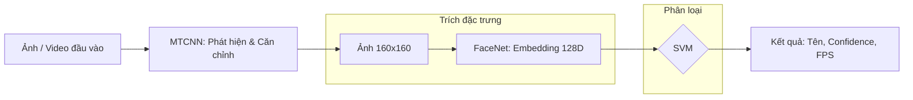

# 🚀 Hệ thống Nhận diện Khuôn mặt – **MTCNN + FaceNet**  
**Tác giả**: Võ Phúc Thịnh  
📅 **Ngày**: 31/08/2025  

---

## 📖 Giới thiệu  
Hệ thống này kết hợp **MTCNN** (phát hiện & căn chỉnh khuôn mặt) và **FaceNet** (tạo vector embedding), cùng với bộ phân loại (**SVM / Softmax**) để **nhận diện khuôn mặt chính xác cao**.  

👉 Hỗ trợ cả:  
- 🌐 **Giao diện Web** (_Streamlit/WebRTC_)  
- 🖥 **Giao diện GUI** (_PyQt_)  
- 📷 **Camera trực tiếp**  
- 🎞 **Video có sẵn**  

---

## 🌟 Điểm nổi bật  

### 🖥 GUI (PyQt)  
- Nút dễ sử dụng: **bật/tắt camera**, **thêm người dùng**, **nhận diện**.  
- Hiển thị **bounding box, tên, FPS** và **độ tin cậy (confidence)** trên ảnh trực tiếp.  
- Có thể gắn **logo thương hiệu**.  

### 🌐 Web (Streamlit + WebRTC)  
- Hỗ trợ **nhận diện trực tiếp qua webcam** trong trình duyệt.  
- Hiển thị **bounding box, tên, FPS** và **độ tin cậy (confidence)**.  
- Giao diện đẹp, trực quan, dễ dùng.  

---

## 📋 Tính năng chính  
- 🔍 **Phát hiện & căn chỉnh khuôn mặt** bằng _MTCNN_ với **5 điểm mốc** (mắt, mũi, miệng).  
- 🧠 **Sinh vector embedding** bằng _FaceNet_ (128 chiều).  
- 📊 **Nhận diện danh tính** bằng **SVM**.  
- 💾 Quản lý dataset:  
  - Ảnh gốc → `Dataset/FaceData/raw/`  
  - Ảnh đã căn chỉnh → `Dataset/FaceData/processed/` (_tự động sinh bounding boxes_).  

---

## 🚀 Khởi động nhanh  

### 1) Cài môi trường  
```bash
python -m venv venv  
source venv/bin/activate  # Linux/Mac  
venv\Scripts\activate     # Windows  

pip install -r requirements.txt
```
## Yêu cầu hệ thống:
-Python: 3.8 (đã thử và gợi ý).  
-OS: Windows / Linux / MacOS.  
-RAM: ≥ 4GB (khuyên dùng ≥ 8GB).  
-GPU: NVIDIA CUDA/cuDNN (tùy chọn, để tăng tốc).  
## 2) Chạy chương trình
```bash
python GUI.py #giao diện local
streamlit run app.py #giao diện web
```
## Cách sử dụng:
*1. Thêm dữ liệu người dùng:*  
-Thêm ảnh trực tiếp vào file **Dataset/FaceData/raw**.  
-Chụp ảnh trực tiếp từ **webcam**  
*2. Căn chỉnh và tiền xử lý:*  
```bash
python align_dataset_mtcnn.py
```
(sinh ảnh căn chỉnh và bounding boxes trong Dataset/FaceData/processed)  
*3. Huấn luyện bộ phân loại*  
```bash
python classifier.py TRAIN Dataset/FaceData/processed Models/facemodel.pkl
```
*4. Nhận diện trực tiếp hoặc qua video*  
Chạy webcam, video bằng local hoặc web, hiển thị **tên**, **độ tự tin** và **FPS**.  
*5. Đánh giá hiệu năng*  
```bash
python validate_on_ifw.py
```
## 🏗 Kiến trúc hệ thống:

##Cấu trúc dự án:  
```text
FaceQTH/
├── Dataset/
│   └── FaceData/
│       ├── raw/          # Ảnh gốc
│       └── processed/    # Ảnh căn chỉnh + bounding boxes
├── Models/
│   ├── 20180402-114759.pb  # FaceNet pretrained
│   ├── facemodel.pkl       # Bộ phân loại
│   └── *.ckpt              # Checkpoints
├── src/
│   ├── align/                # MTCNN detector
│   ├── facenet.py            # Tiện ích FaceNet
│   ├── classifier.py         # Huấn luyện classifier
│   ├── face_rec_cam.py       # Nhận diện camera
│   ├── face_rec_cam_web.py   # Phiên bản Streamlit
│   └── align_dataset_mtcnn.py # Tiền xử lý dataset
├── test/        # Unit test
├── video/       # Video test
├── app.py       # Entry cho Streamlit
├── GUI.py       # Entry cho PyQt GUI
└── requirements.txt  # Thư viện
```
##Cấu hình và tinh chỉnh:  
-Ngưỡng phát hiện: điều chỉnh trong dectect_face.py.  
-Kích thước ảnh: 160x160 (mặc định).  
-Bộ phân loại: SVM (mặc định).
-FPS: tính bằng time.time() trong vòng lặp.  
## Hiệu năng và đánh giá:  
## Ảnh minh họa:  

